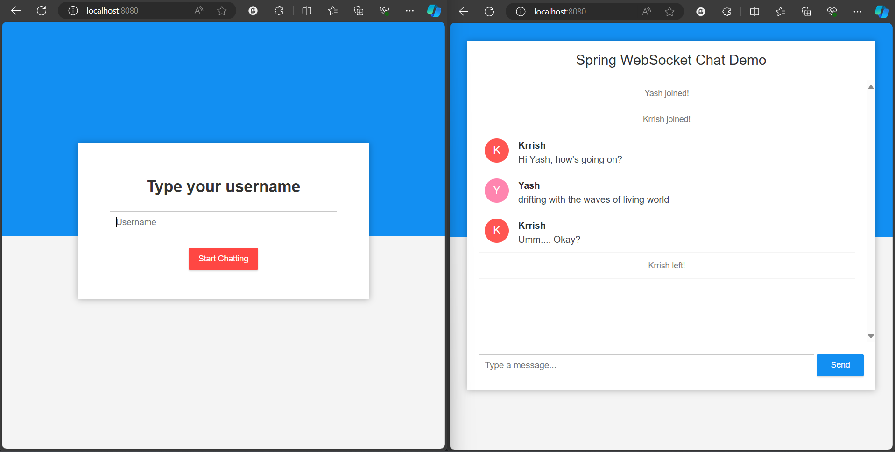

# Spring WebSocket Chat Application



## REQUIREMENTS

- Java 11 or more
- Maven 13.x.x

## SETUP

### Windows

1. **Clone the repository:**
    ```bash
    git clone https://github.com/krrishmahar/project-series.git
    ```

2. **Build the project using Maven:**
    ```bash
    cd \Week1_Java\ChatApplication
    mvn clean install
    ```

3. **Run the application:**
    ```bash
    mvn spring-boot:run
    ```

4. **Open your browser and go to:**
    ```
    http://localhost:8080
    ```

### Linux

1. **Clone the repository:**
    ```bash
    git clone https://github.com/krrishmahar/project-series.git
    ```

2. **Build the project using Maven:**
    ```bash
    cd \Week1_Java\ChatApplication
    ./mvnw clean install
    ```

3. **Run the application:**
    ```bash
    ./mvnw spring-boot:run
    ```

4. **Open your browser and go to:**
    ```
    http://localhost:8080
    ```

## Contributing

Feel free to fork this repository, make changes, and submit pull requests. Contributions are welcome!

Hit the ⭐ button if you found this useful. #HappyCoding
