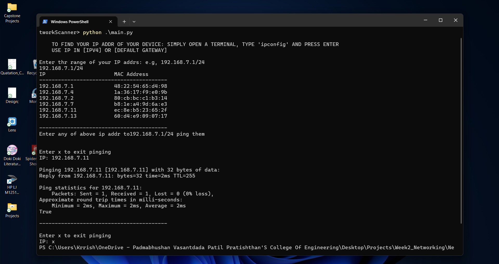

# Network Scanner

This project is a simple network scanner that uses ARP requests to find all devices on a local network and allows you to ping them. It is written in Python and utilizes the Scapy library.



## Requirements

- Python 3.x
- Scapy
- Npcap (for Windows users)

## Installation

### Windows

1. **Install Python 3.x:** Download and install Python from the [official website](https://www.python.org/downloads/).

2. **Install Npcap:** Download and install Npcap from the [official website](https://nmap.org/npcap/).

### Linux

1. **Install Python 3.x:** Use your package manager to install Python. For example, on Ubuntu:
    ```bash
    sudo apt update
    sudo apt install python3 python3-pip
    ```

## Setting Up Virtual Environment and Installing Dependencies

1. **Clone the repository:**
    ```bash
    git clone <https://github.com/krrishmahar/project-series.git>
    cd NetworkScanner
    ```

2. **Create a virtual environment:**
    ```bash
    python -m venv venv
    ```

3. **Activate the virtual environment:**

    - **Windows:**
        ```bash
        .\venv\Scripts\activate
        ```

    - **Linux/Mac:**
        ```bash
        source venv/bin/activate
        ```

4. **Install the required packages:**
    ```bash
    pip install -r requirements.txt
    ```
5. **Deactivate the environment:**
    ```bash
    deactivate
    ```

## Usage

1. **Run the script:**
    ```bash
    python main.py
    ```

2. Follow the on-screen instructions to enter your IP address range and ping the devices.


## Contributing

Feel free to fork this repository, make changes, and submit pull requests. Contributions are welcome!

Hit the ⭐ button if you found this useful. #HappyCoding
